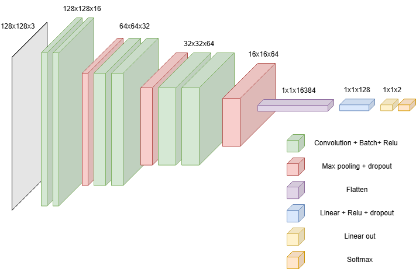
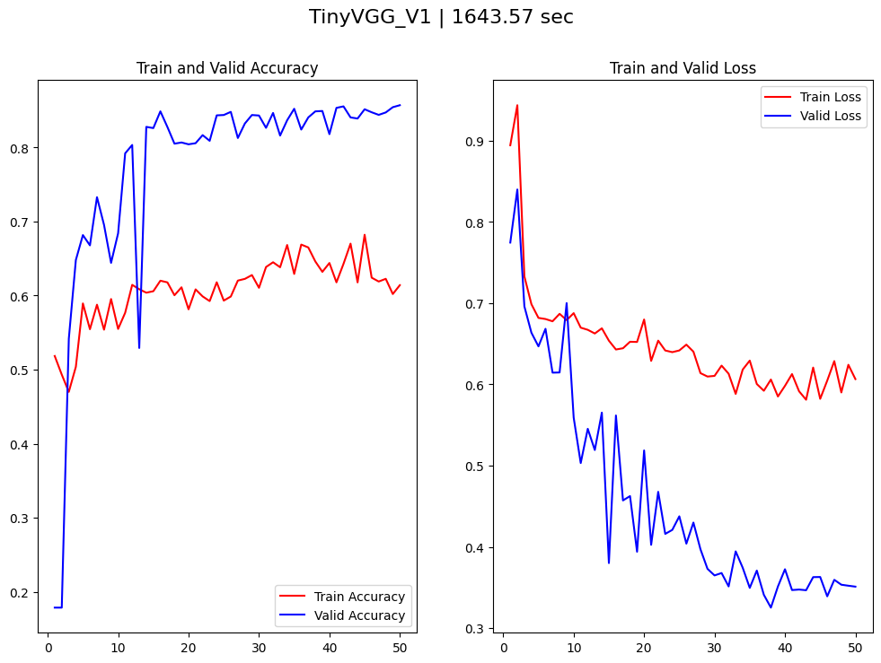
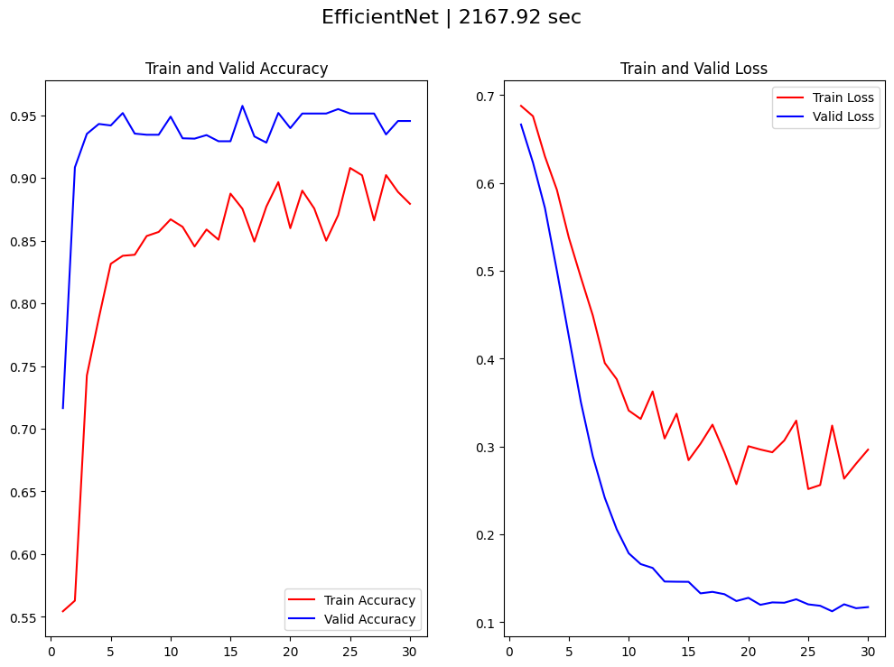

<!-- omit in toc -->
## Languages
[](#)

---

<!-- omit in toc -->
## Frameworks
[](#)
[](#)

---

<!-- omit in toc -->
## Table of Contents
- [Introduction](#introduction)
- [Project Workflow](#project-workflow)

---

## Introduction

This project is the final task for the Neural Networks course at [BigDataLab](https://www.bigdatalab.com.ua/).  
The task is binary image classification using convolutional neural networks. The classifier determines whether dishes are clean or dirty using the dataset in the [data folder](./data/).

**Project steps:**
- Perform data augmentation for the dishes dataset due to its small size.
- Train a **TinyVGG-like** model to achieve **accuracy > 0.7**.
- Train a **transfer learning** model to achieve **accuracy > 0.8**.
- Build a confusion matrix.
- Deploy the model to production.

---

## Project Workflow

1. **Compute mean and std for train data** to normalize augmentation for the **TinyVGG-like** model.
2. **Create augmentation** for the **TinyVGG-like** model:
    ```python
    class AugmentationV1:
        size = (128, 128)
        mean = [0.519, 0.499, 0.469]
        std = [0.175, 0.183, 0.197]
        
        def get_train(self):
            compose_list = [
                v2.Resize(self.size),
                v2.RandomHorizontalFlip(),
                v2.RandomVerticalFlip(),
                v2.RandomRotation(degrees=10),
                v2.ColorJitter(brightness=0.1, contrast=0.1, saturation=0.1, hue=0.05),
                v2.TrivialAugmentWide(num_magnitude_bins=31),
                v2.ToImage(),
                v2.ToDtype(torch.float32, scale=True),
                v2.Normalize(mean=self.mean, std=self.std),
            ]
            augment = v2.Compose(compose_list)
            return augment

        def get_test(self):
            compose_list = [
                v2.Resize(self.size),
                v2.ToImage(),
                v2.ToDtype(torch.float32, scale=True),
                v2.Normalize(mean=self.mean, std=self.std),
            ]
            augment = v2.Compose(compose_list)
            return augment
    ```
3. **Divide test data** into validation and test sets because the size of the train and test data is the same.
4. **Create dataloaders** with **BATCH SIZE = 32**.
5. **Build a TinyVGG-like model** with the architecture below:  
   
6. **Training settings** for the model (save each epoch):
    ```python
    epochs = 50

    tinyVgg_v1 = TinyVGG_V1(input_channels=3, output_classes=len(CLASS_NAMES)).to(device)

    loss_fn = CrossEntropyLoss().to(device)
    accuracy_fn = MulticlassAccuracy(num_classes=len(CLASS_NAMES)).to(device)

    optimizer = RAdam(
        params=tinyVgg_v1.parameters(),
        lr=0.01,
    )
    scheduler = ReduceLROnPlateau(
        optimizer=optimizer,
        factor=0.9,
        patience=0,
    )
    ```
7. **Best weights from epoch 42** will be used for deployment.  
   
8. **Results:**  
   Achieved ~93% accuracy on test data, but many images were guessed correctly with ~50% confidence.

    - 235/251 Accuracy: **93.63%**
    - Precision: **0.9209**
    - Recall: **0.9366**
    - F1: **0.9280**

9. **Started training a pretrained model.** Used the same augmentation, but mean and std were taken from ImageNet (torch library).
10. **Chose [EfficientNet B2 model](https://docs.pytorch.org/vision/main/models/generated/torchvision.models.efficientnet_b2.html#torchvision.models.efficientnet_b2)**. The classifier was replaced (default: 1000 outputs, custom: 2):
    ```python
    efficientnet_b2_model.classifier = torch.nn.Sequential(
        torch.nn.Dropout(p=0.5, inplace=False),
        torch.nn.Linear(in_features=1408, out_features=256, bias=True),
        torch.nn.ReLU(inplace=False),
        torch.nn.Dropout(0.5, inplace=False),
        torch.nn.Linear(in_features=256, out_features=len(CLASS_NAMES), bias=True)
    ).to(device)
    ```
11. **Training settings** same as TinyVGG-like, but RAdam learning rate = 0.001.
12. **Best weights from epoch 26** will be used for deployment.  
    
13. **Results:**  
    Achieved ~95% accuracy on test data with high confidence.

    - 239/251 Accuracy: **95.22%**
    - Precision: **0.9402**
    - Recall: **0.9551**
    - F1: **0.9469**

14. **On hidden dataset (deployed model):**

    - **TinyVGG(best epoch):**
        - 175/219 Accuracy: **79.91%**
        - Precision: **0.8016**
        - Recall: **0.7989**
        - F1: **0.7986**
    - **EfficientNet(best epoch):**
        - 198/219 Accuracy: **90.41%**
        - Precision: **0.9067**
        - Recall: **0.9043**
        - F1: **0.9040**

15. **Plates classification from hidden dataset on EfficientNet:**  
    